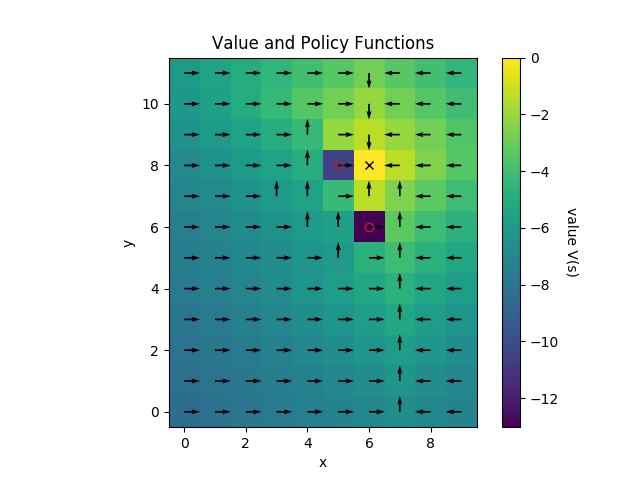

# markov_decision_process

Examples of Markov Decision Processes (MDPs)

# Windy Gridworld

[windy_gridworld.py](windy_gridworld.py)

This problem is loosely based on example 6.5 in
[Reinforcement Learning](https://web.stanford.edu/class/psych209/Readings/SuttonBartoIPRLBook2ndEd.pdf)
by Sutton and Barto.

The agent's state is their (x, y) location on a grid,
and the actions are {stay, left, right, down, up}.
The problem is episodic, and ends when the agent reaches
the target location (the X in the image above). The reward
is -1 in every period, so the agent's goal is to reach the
target in as few moves as possible.

There are two complications that make the problem interesting:

* Certain positions are "passable obstacles" (denote by a
red X in the image above), and these are very costly (the
reward is -10; you can imagine the agent getting "stuck" for
10 moves if they walk into one of these locations).
* There is random "wind" in the up-down direction (y axis),
which sometimes pushes the agent either up or down beyond their
intended move. This means the agent might be pushed into a
costly obstacle. Notice that the optimal policy (black arrows
in the figure above) involves circumventing the obstacles by a
wide margin in the y direction.
