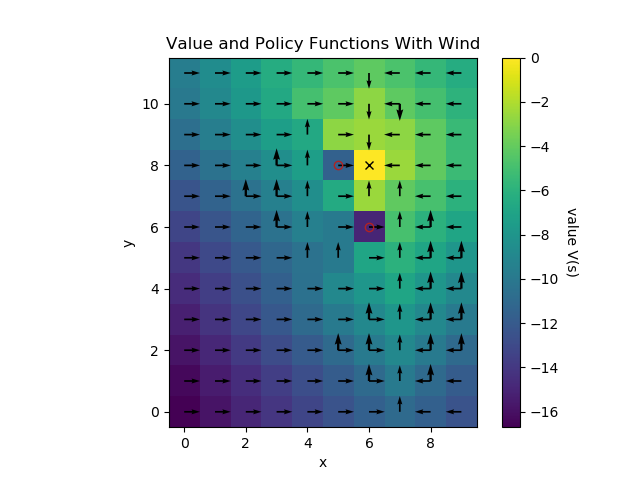

# markov_decision_process

Examples of Markov Decision Processes (MDPs)

# Cake Eating Problem

The agent's state is their wealth (amount of cake), and their action is how much to consume in the current period.
Time is discrete and infinite (the problem goes on forever), and state transitions are deterministic (there is no randomness).

The state space and action space are each infinite (which tends to make a problem difficult)
but only one dimensional (which makes a problem simple: there is no curse of dimensionality).
Interestingly, the cake eating problem can be solved (exactly) by hand, with pen and paper, and
this means we can compare approximate numerical solutions to the true solution and see how our MDP solver performed.

Related PDFs:

* http://users.ox.ac.uk/~exet2581/recursive/dp_mat.pdf describes a similar problem (a cake eating problem with a _finite_ time horizon), and
* http://www2.econ.iastate.edu/tesfatsi/dpintro.cooper.pdf describes this exact problem (the infinite-horizon cake eating problem).

# Windy Gridworld

Solutions:

* [WindyGridWorld.elm](elm/src/WindyGridWorld.elm)
* [WindyGridWorld.jl](julia/WindyGridWorld.jl)
* [windy_gridworld.py](python/windy_gridworld.py)

This problem is loosely based on Figure 4.2 and on Example 6.5 in
[Reinforcement Learning](https://web.stanford.edu/class/psych209/Readings/SuttonBartoIPRLBook2ndEd.pdf)
by Sutton and Barto.

The agent's state is their (x, y) location on a grid,
and the actions are {stay, left, right, down, up}.
The problem is episodic, and ends when the agent reaches
the target location (the X in the image above). The
[reward is -1](python/windy_gridworld.py#L15)
in every period, so the agent's goal is to reach the
target in as few moves as possible.

There are two complications that make the problem interesting:

* Certain positions are "passable obstacles" (denoted by
red circles in the image above), and these are very costly (the
[reward is -10](python/windy_gridworld.py#L19)
; you can imagine the agent getting "stuck" for
10 moves if they walk into one of these locations).
* There is random "wind" in the up-down direction (y axis),
which sometimes pushes the agent [either up or down](python/windy_gridworld.py#L32)
beyond their intended move. This means the agent might be pushed into a
costly obstacle if they are either directly above or beneath it.
Notice that the optimal policy (black arrows in the figure above)
involves circumventing the obstacles by a wide margin in the
y direction.

The addition of randomness (the wind) changes the solution in
subtle ways:

* In the non-stochastic version of the problem (i.e. without wind),
there are many more ties in the policy function
(i.e. points in the state space at which there are multiple optimal actions).
There exist multiple paths of equal length that avoid the obstacles and reach the
target point in an optimal number of steps, and the agent has no reason to prefer
one such path above another. Adding wind breaks _most_ (but not all) ties:
with wind, the agent generally prefers to remain far from the obstacles (to reduce the
probability of being blown into one), but also has the possibility of using the wind
advantageously (by moving horizontally and letting the wind move the agent vertically).

* The value function is _generally_ lower with wind (because the agent now faces
the risk that they will hit an obstacle, even when they act optimally), but at
certain values of the wind probabilities and at certain points in the state space,
the reverse can be true.

* It is sometimes optimal for the agent to walk straight towards the obstacle!

